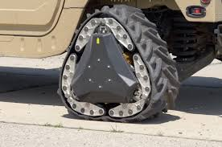
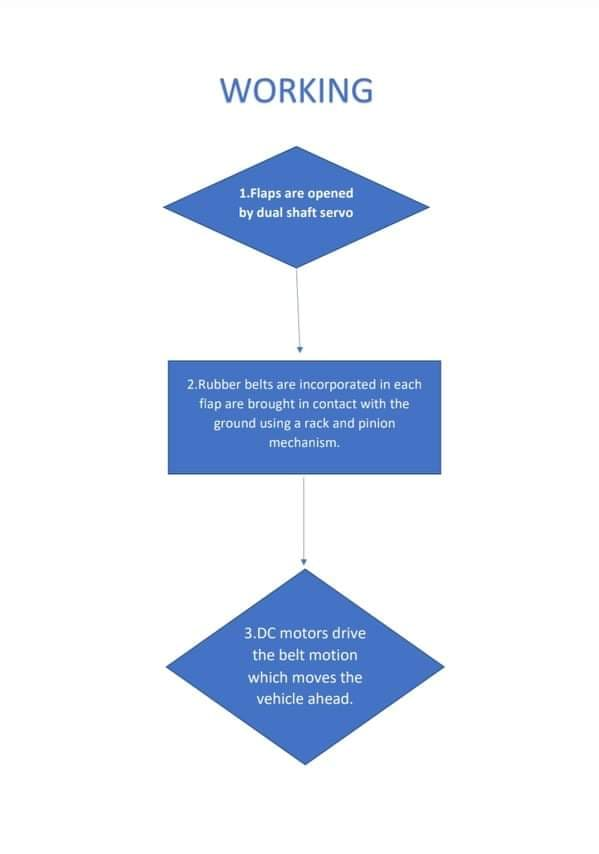
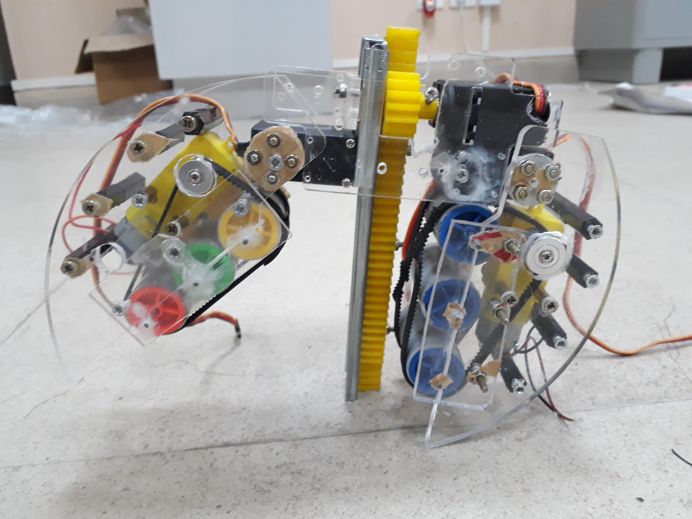
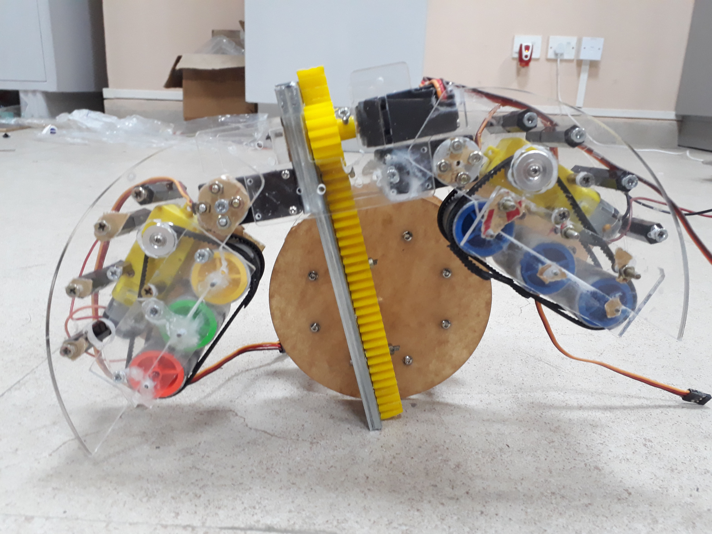
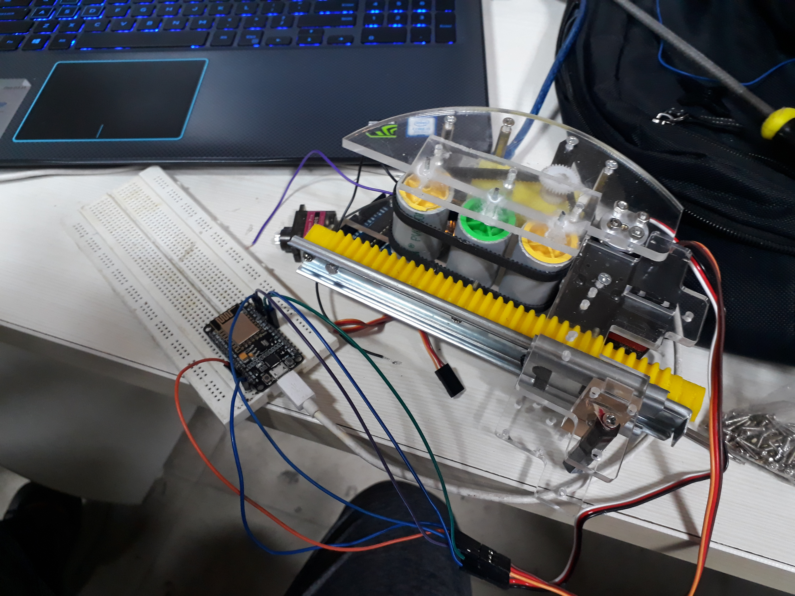
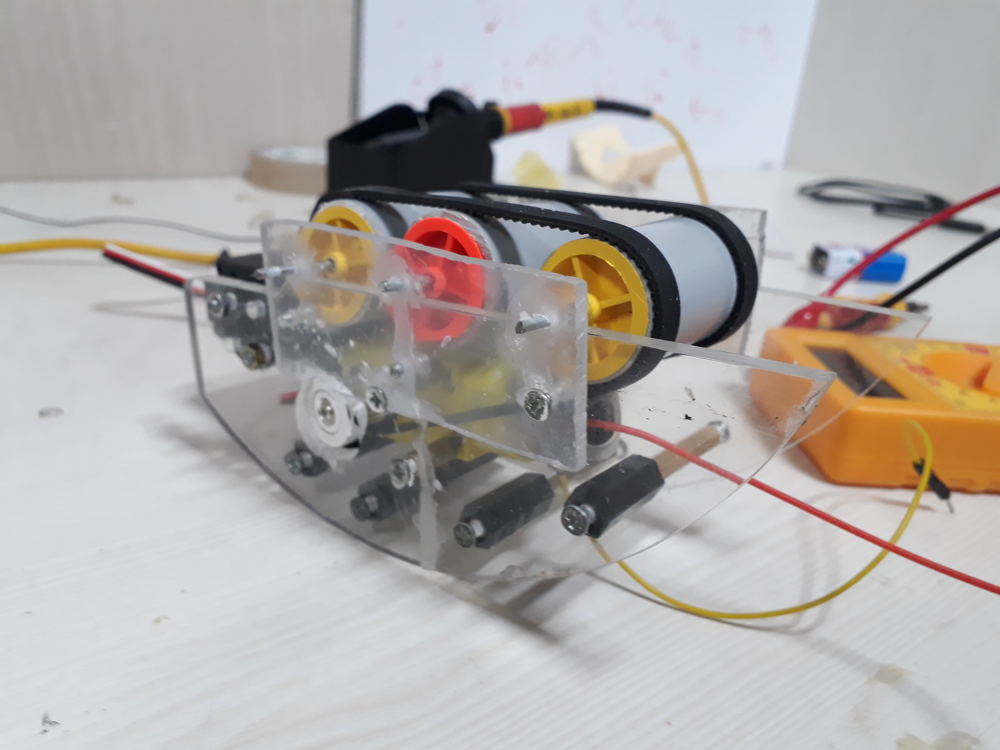

# Shapeshifter-Techevince7.0

### INTRODUCTION

Wikipedia defines SHAPESHIFTER as something/someone that can physically transform and change its shape. Our project was inspired by DARPA’s shapeshifting wheel – a wheel that can change its shape adapting the terrain, making it an all-terrain traveling vehicle. Since this is a prototype we have tweaked with the mechanism and made the wheel such that it transforms into a tank-like track allowing broader terrain access to small vehicles too .The heart of the mechanism lies in the back wheels of the bot which can be controlled through a Wi-fi application in your mobile phones .The wheel itself is made of 3 layers of structure, the frame, The flaps(the ones which open up to reveal the track belt ), The linear actuator, which is necessary to bring the belt in contact with the ground. The two wheels work in tandem with the help of a very simple mechanism rather than using gyroscopes.
              
   

### METHODOLOGY

Materials Required: Acrylic sheet, Rack and Pinions X(2),Dual Shaft Servos X(4), Single Shaft Servos[360s x(2),180(1)],Node MCU(esp8266),Servo Driver ,Motor Driver ,Dual Shaft DC motors X(4) , Rubber Belts ,Spacers and Screws ,Threaded Axles , 1-DC 60RPM motor , LiPo Battery ,Screw and Nuts.
      
   

### RESULTS AND CONCLUSION

1. We were able to make a bot which is capable of traversing on surface such as asphalt , ceramic, sand and plenty other rough terrains as compared to ordinary wheels
2. This prototype has a high potential to serve in defense vehicles as it gives versatility to the vehicle, as a result in the logistics for the martial forces
3. The prototype is also a ground base for further development and making a replacing the tracks seen in construction site machinery, saving fuel and resources for their transport.

               

### REFERENCES

1.For parts of the robot: (I)www.robu.in
                          (II)www.robokits.co.in
                          (III)www.thingbits.net
                          (IV)www.amazon.in

2.Tutorial series for Arduino: Tutorial Series for Arduino by Jeremy Blum, YouTube Video.

3.For Understanding a Car’s Steering and Power steering: Understanding your Car's Steering & Power Steering ! By Learn Engineering, YouTube video.

4.Inspiration for the project: DARPA’s shapeshifting wheel .

